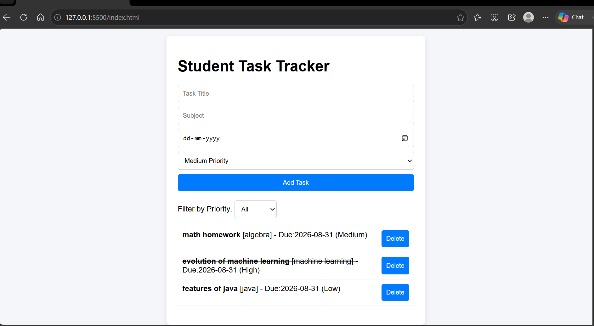
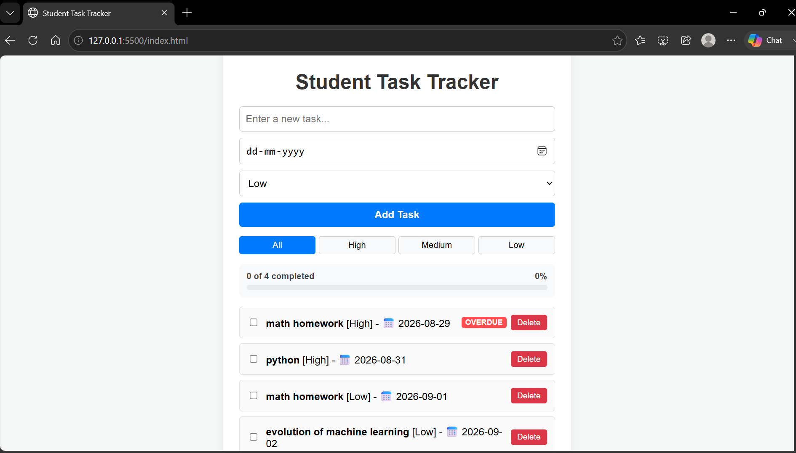

# Student Task Tracker 🎓

A responsive, client-side task management web application built to help students track deadlines, organize assignments by priority, and monitor overall progress in real time.

---

## 📷 Project Evolution & Preview

### Initial Version (V1)


### Updated Version (V2 - Progress Tracker, Overdue Badges & Filters)


---

## ✨ Features & Updates

* **Task Management:** Create, mark complete, and delete tasks dynamically.
* **Persistent Storage:** Saves tasks in browser `localStorage` so data isn't lost on page refresh.
* **Smart Deadline Sorting:** Automatically sorts tasks to display upcoming deadlines first.
* **Automated Alert Badges:** Highlights tasks as **OVERDUE** or **DUE TODAY** based on target dates.
* **Priority Filtering:** Filter tasks easily by priority levels (**High**, **Medium**, **Low**).
* **Live Progress Bar:** Tracks completed task percentages dynamically in real-time.

---

## 🛠️ Tech Stack

* **HTML5** - Structured semantic layout
* **CSS3** - Responsive styling & dynamic badge alerts
* **JavaScript (ES6+)** - DOM manipulation, state management, and `localStorage` API

---

## 🚀 How to Run Locally

1. Clone this repository:
   ```bash
   git clone [https://github.com/maazinnifaal/student-task-tracker.git](https://github.com/maazinnifaal/student-task-tracker.git)